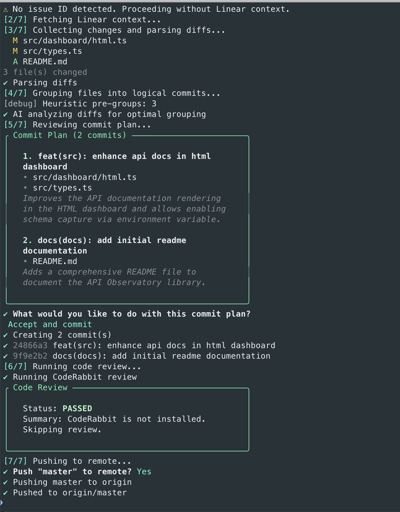

<p align="center">
  <h1 align="center">git-ship</h1>
  <p align="center">
    AI-powered git workflow that turns your messy changes into clean, grouped, conventional commits — then reviews, pushes, and creates a pull request.
    <br />
    One command: <code>git-ship</code>
  </p>
</p>

<p align="center">
  <a href="https://www.npmjs.com/package/git-ship"></a>
  <a href="https://www.npmjs.com/package/git-ship"></a>
  <a href="https://github.com/thisismayank/git-ship/blob/master/LICENSE"></a>
  = 18" />
</p>

---

Stop writing commit messages. `git-ship` reads your diffs, groups related changes into logical commits, writes conventional commit messages using AI, runs a code review, and pushes — all in one command.

## Table of Contents

- [Why I Built This](#why-i-built-this)
- [How It Works](#how-it-works)
- [Install](#install)
- [Quick Start](#quick-start)
- [Usage](#usage)
- [Configuration Commands](#configuration-commands)
- [What Makes It Different](#what-makes-it-different)
- [Issue Tracker Integration](#issue-tracker-integration)
- [Commit Message Structure](#commit-message-structure)
- [Branch Parsing](#branch-parsing)
- [Commit Grouping](#commit-grouping)
- [Code Review](#code-review)
- [Pull Request Creation](#pull-request-creation)
- [Configuration](#configuration)
- [Graceful Degradation](#graceful-degradation)
- [Requirements](#requirements)
- [License](#license)

## Why I Built This

Every developer knows the routine: you've been heads-down on a feature for hours, touching fifteen files across four concerns. Now it's time to commit. You stare at `git diff --stat`, mentally sort files into groups, write conventional commit messages, stage carefully, and hope you didn't mix a migration with a test change. Then you do it again for the next group. And the next.

Most of the time, you give up and write `git commit -am "update stuff"`. The commit history turns into noise. When someone needs to bisect a bug or review what changed, the history is useless.

I built **git-ship** because the commit–review–push workflow felt like it should be one step. The AI is good at reading diffs and understanding which changes belong together. The branch name already tells you what you're working on. The review tool is already installed. Why am I the glue between all of these?

Now I run `gs`, review the plan, and hit enter. Clean history, every time.

<p align="center">
  
</p>

## How It Works

```
$ git-ship

[1/8] Detect branch        → parse issue ID from branch name (e.g., feat/ENG-123-...)
[2/8] Fetch issue context  → pull from Linear, Jira, Asana, or enter plain text
[3/8] Collect changes      → structured diffs for all changed files
[4/8] Group into commits   → heuristic pre-group, then AI refines into revertable commits
[5/8] Review commit plan   → accept / edit messages / regroup / cancel
[6/8] Code review          → CodeRabbit, Devin, Codex, or Graphite
[7/8] Push to remote
[8/8] Create pull request  → AI-generated PR with summary, problem, solution, impact
```

You stay in control. Every step is interactive — review the plan, edit messages, regroup files, or cancel at any point.

## Install

```bash
npm install -g git-ship
```

## Quick Start

On first run, git-ship launches an interactive setup wizard:

```
$ gs

Welcome to git-ship! Let's set up your configuration.

1. AI Provider Configuration
   → Choose OpenAI, Anthropic, or Gemini
   → Enter your API key (saved to shell profile)

2. Issue Tracker Integration
   → Linear (recommended) - automatic issue fetching
   → Jira (experimental) - requires base URL and API token
   → Asana (experimental) - requires access token
   → Plain Text - enter requirements manually each time
   → None - commits based on diffs only

3. Code Review Tool (Optional)
   → Choose Graphite, CodeRabbit, Codex, Devin, or skip

4. Commit Settings
   → Max commit header length (body has no limit)
```

Configuration is saved globally (`~/.config/gitship/config.json`) and works across all repos.

## Usage

```bash
git-ship              # Full interactive flow
gs                    # Shorthand alias
gs --dry-run          # Preview commit plan without executing
gs --no-review        # Skip code review
gs --issue ENG-123    # Manually specify issue ID
gs --setup            # Re-run setup wizard
gs config             # View current configuration
gs config set <key> <value>  # Update a specific setting
gs pr                 # Create a PR for the current branch
gs pr --draft         # Create as draft PR
```

| Flag                   | Description                                                       |
| ---------------------- | ----------------------------------------------------------------- |
| `-h, --help`           | Show all available commands with descriptions                     |
| `-d, --dry-run`        | Show commit plan without executing                                |
| `-v, --verbose`        | Enable debug logging                                              |
| `--review-tool <tool>` | Override review tool (`coderabbit`, `devin`, `codex`, `graphite`) |
| `--no-review`          | Skip code review                                                  |
| `-i, --issue <id>`     | Manually specify issue ID                                         |
| `--setup`              | Re-run setup wizard to update API keys or configuration           |
| `--readme`             | Display the full README documentation in terminal                 |

## Configuration Commands

Quickly view or update settings without re-running the full setup wizard:

```bash
# View current configuration
gs config
gs config show
gs config show --json

# Update specific settings
gs config set commits.headerLength 50
gs config set ai.provider anthropic
gs config set ai.model claude-sonnet-4-20250514
gs config set issueTracker.provider plain
gs config set review.enabled false

# Show config file paths
gs config path
```

### Available Config Keys

| Key                       | Values                                     | Description                  |
| ------------------------- | ------------------------------------------ | ---------------------------- |
| `commits.headerLength`    | `20` - `200`                               | Max commit header length     |
| `commits.conventional`    | `true`, `false`                            | Use conventional commits     |
| `commits.includeIssueRef` | `true`, `false`                            | Include issue ref in commits |
| `issueTracker.provider`   | `linear`, `jira`, `asana`, `plain`, `none` | Issue tracker to use         |
| `ai.provider`             | `openai`, `anthropic`, `gemini`            | AI provider for analysis     |
| `ai.model`                | Model name string                          | AI model to use              |
| `review.enabled`          | `true`, `false`                            | Enable code review           |
| `review.tool`             | `coderabbit`, `devin`, `codex`, `graphite` | Code review tool             |

## What Makes It Different

|                           |                                                                                                                                          |
| ------------------------- | ---------------------------------------------------------------------------------------------------------------------------------------- |
| **AI commit grouping**    | Produces small, reviewer-friendly commits that are each safe to revert — powered by OpenAI, Anthropic, or Gemini with heuristic fallback |
| **Multi-tracker support** | Works with Linear, Jira, Asana, or plain text requirements — not locked to one platform                                                  |
| **Rich commit messages**  | Header (limited length) + body (detailed explanation) + footer (requirement mapping)                                                     |
| **Code review gate**      | Runs CodeRabbit, Devin, Codex, or Graphite before pushing. Critical findings block the push.                                             |
| **Conventional commits**  | Enforces type, scope, imperative mood, configurable length — no more inconsistent commit history                                         |
| **Smart file filtering**  | Automatically ignores `node_modules`, `.env*`, `dist`, `.DS_Store`, `.gitshiprc.json` — configurable via `ignorePatterns`                |
| **Global + local config** | One-time setup works across all repos; override per-repo when needed                                                                     |

## Issue Tracker Integration

git-ship supports multiple issue tracking systems to provide context for better commit messages:

### Linear (Recommended)

Automatically fetches issue details using your `LINEAR_API_KEY`:

```bash
# During setup, or manually:
gs config set issueTracker.provider linear
```

### Jira (Experimental)

Requires your Jira instance URL and API credentials:

```bash
# Environment variables needed:
export JIRA_EMAIL="you@company.com"
export JIRA_API_TOKEN="your-api-token"

# Config:
gs config set issueTracker.provider jira
```

Configure your Jira base URL in `.gitshiprc.json`:

```json
{
  "jira": {
    "baseUrl": "https://yourcompany.atlassian.net",
    "projectKey": "PROJ"
  }
}
```

### Asana (Experimental)

Requires your Asana personal access token:

```bash
export ASANA_ACCESS_TOKEN="your-access-token"
gs config set issueTracker.provider asana
```

Note: Asana uses numeric task GIDs. Include the GID in your branch name (e.g., `feat/1234567890123-task-name`).

### Plain Text

Enter requirements manually each time you commit:

```bash
gs config set issueTracker.provider plain
```

When you run `gs`, you'll be prompted:

```
? Would you like to provide context/requirements for these changes? Yes
? Enter the requirements or context for these changes: Add user authentication with OAuth2
```

### None

Skip issue context entirely. Commits will be based on diffs only.

**Warning:** Without context, commit messages will be generic:

```
feat(src): feat changes in src
chore(root): chore changes in root
```

With context, you get meaningful messages:

```
feat(auth): add OAuth2 login with Google provider
fix(cart): resolve race condition in quantity update
```

## Commit Message Structure

git-ship generates rich, structured commit messages:

```
┌──────────────────────────────────────────────────────────────┐
│ feat(auth): add OAuth2 login with Google provider            │ ← Header (limited length)
│                                                              │
│ Implement Google OAuth2 authentication:                      │
│ - Add OAuth2 callback handler                                │ ← Body (detailed, no limit)
│ - Store tokens securely in session                           │
│ - Add logout endpoint to revoke tokens                       │
│                                                              │
│ Addresses: "Users should be able to log in with Google"      │ ← Footer (requirement mapping)
│ Refs: ENG-123                                                │
└──────────────────────────────────────────────────────────────┘
```

- **Header**: Short summary shown in `git log`, limited to your configured length (default: 72)
- **Body**: Detailed explanation of what changed and why — no length limit
- **Footer**: Links commit to specific requirements + issue reference

## Branch Parsing

git-ship detects issue IDs from branch names with flexible matching:

| Branch Name                        | Detected Issue | Confidence |
| ---------------------------------- | -------------- | ---------- |
| `feat/ENG-123-user-auth`           | `ENG-123`      | High       |
| `fix/eng-456`                      | `ENG-456`      | High       |
| `feat/oxford-optimisation-elm-123` | `ELM-123`      | High\*     |
| `mayank/DES-789-design-update`     | `DES-789`      | High       |
| `feature-abc-123-description`      | `ABC-123`      | Medium\*\* |

\*If `ELM` is in your configured team prefixes
\*\*Medium confidence prompts for confirmation

Configure team prefixes during setup or in config:

```json
{
  "branch": {
    "teamPrefixes": ["ENG", "DES", "ELM", "PROD"]
  }
}
```

## Commit Grouping

Files are grouped using a two-pass approach that balances two goals: **small, reviewer-friendly commits** and **safe revertability**. Every commit should be easy to review in isolation _and_ safe to revert without breaking the build.

### Pass 1 — Heuristic pre-grouping

A fast first pass groups files by path patterns:

| Pattern                   | Category             |
| ------------------------- | -------------------- |
| `*.test.ts`, `tests/`     | `test`               |
| `*.md`, `docs/`           | `docs`               |
| `Dockerfile`, `.github/`  | `ci-infra`           |
| `package.json`, lockfiles | `deps`               |
| `migrations/`             | `migration`          |
| Source files              | Grouped by directory |

### Pass 2 — AI refinement

The AI reads every diff and applies two tests:

1. **The Revert Test** (safety floor) — _"If this commit were reverted, would the codebase still compile and run?"_ Files that depend on each other must stay together.
2. **The Review Test** (quality goal) — _"Can a reviewer understand this commit without reading the others?"_ Prefer smaller, focused commits that each tell one clear story.

When issue context is available (from Linear, Jira, Asana, or plain text), the AI uses it to better understand the intent of your changes and map commits to specific requirements.

### AI Failure Handling

If the AI call fails (e.g., API quota exceeded, rate limit, invalid key), git-ship:

1. Shows a prominent error message with the reason
2. Displays a suggestion for fixing the issue
3. Lets you choose: **Continue with basic commits**, **Retry**, or **Cancel**

```
✖ AI commit analysis failed
✖ API quota or rate limit exceeded
  Suggestion: Check your OPENAI_API_KEY or ANTHROPIC_API_KEY env var.

? How would you like to proceed?
❯ Continue with basic commits (generic messages)
  Retry AI analysis
  Cancel
```

### Fallback

If AI is unavailable or you choose to continue without it, heuristic groups from Pass 1 are used directly with auto-generated conventional commit messages.

## Code Review

| Tool       | Status       | Notes                                                              |
| ---------- | ------------ | ------------------------------------------------------------------ |
| Graphite   | Recommended  | Uses `gt` CLI — install with `npm i -g @withgraphite/graphite-cli` |
| CodeRabbit | Experimental | Requires CLI or API key                                            |
| Codex      | Experimental | Uses your `OPENAI_API_KEY`                                         |
| Devin      | Experimental | Limited access, invite-only                                        |

Findings are normalized with severity levels (`critical`, `warning`, `info`). Critical findings block the push by default.

## Pull Request Creation

After pushing, git-ship can create a pull request with an AI-generated description that follows industry standards.

### Automatic PR (after push)

At the end of the `gs` workflow, you'll be prompted:

```
? Create a pull request? Yes
? PR title: feat(auth): add OAuth2 authentication
✓ Generating PR description with AI
? Edit PR description before creating? No
? Create as draft PR? No
✓ Pull request created: https://github.com/user/repo/pull/123
```

### Standalone PR Command

Create a PR anytime for your current branch:

```bash
gs pr                    # Interactive PR creation
gs pr --draft            # Create as draft
gs pr --title "My PR"    # Set title directly
gs pr --base develop     # Target a different base branch
```

### AI-Generated PR Description

The PR description is generated using your configured AI provider and includes:

```markdown
## Summary

Brief 2-3 sentence overview of what this PR does and why.

## Problem

What problem, issue, or requirement does this PR address?

## Solution

How does this PR solve the problem? High-level approach.

## Changes Made

- Key changes organized logically (not just a commit dump)
- Grouped by feature or component

## Impact

What parts of the system are affected? Breaking changes?

## Testing

How was this tested? What should reviewers verify?

## Additional Context

Any other information reviewers should know.
```

### GitHub CLI (Optional)

For automatic PR creation:

- **GitHub CLI (`gh`)** must be installed: `brew install gh`
- Visit https://cli.github.com/ for other operating systems
- Must be authenticated: `gh auth login`

**If `gh` is not available**, git-ship will still generate the PR description and display it for you to copy-paste when creating the PR manually on GitHub.

## Configuration

### Global Configuration

Stored at `~/.config/gitship/config.json`. Created automatically by the setup wizard. Works across all repos.

```bash
gs --setup  # Re-run setup wizard anytime
gs config   # View current settings
```

### API Key Storage

API keys are stored in your shell profile for security and persistence:

| Shell | Profile Location             |
| ----- | ---------------------------- |
| zsh   | `~/.zshrc`                   |
| bash  | `~/.bashrc`                  |
| fish  | `~/.config/fish/config.fish` |

The setup wizard automatically detects your shell and adds keys in the correct format. If a key already exists, you'll be asked whether to use the existing key or update it.

After adding new keys, run `source ~/.zshrc` (or your shell's profile) to use them in the current terminal session.

### Per-Repository Setup

The first time you run `git-ship` in a new repository, you'll see:

```
First time using git-ship in this repository.

? How would you like to configure this repository?
> Use global config (recommended)
  Customize for this repo
  Skip for now
```

- **Use global config** — Creates a minimal `.gitshiprc.json` that references your global settings. The prompt won't appear again.
- **Customize for this repo** — Launches a wizard to override specific settings (AI provider, review tool, commit length, etc.)
- **Skip for now** — Uses global config for this run, but you'll be prompted again next time.

### Local Configuration (per-repo)

Create a `.gitshiprc.json` in your project root to override global settings:

```json
{
  "issueTracker": {
    "provider": "linear"
  },
  "ai": {
    "provider": "openai",
    "model": "gpt-4o"
  },
  "linear": {
    "transport": "graphql"
  },
  "jira": {
    "baseUrl": "https://yourcompany.atlassian.net",
    "projectKey": "ENG"
  },
  "review": {
    "enabled": true,
    "tool": "graphite",
    "transport": "cli"
  },
  "commits": {
    "conventional": true,
    "allowedTypes": [
      "feat",
      "fix",
      "chore",
      "docs",
      "refactor",
      "test",
      "ci",
      "build",
      "perf"
    ],
    "includeIssueRef": true,
    "maxMessageLength": 72
  },
  "ignorePatterns": [
    "node_modules/**",
    ".env*",
    "dist/**",
    ".DS_Store",
    ".gitshiprc.json"
  ],
  "branch": {
    "teamPrefixes": ["ENG", "DES"]
  }
}
```

### Config Precedence

```
CLI flags (--review-tool, --issue, etc.)
    ↓
Environment variables (GITSHIP_*)
    ↓
Local config (.gitshiprc.json)
    ↓
Global config (~/.config/gitship/config.json)
    ↓
Defaults
```

### Environment Variables

git-ship loads `.env` from your project root automatically.

**API keys:**

| Variable             | Description                                           |
| -------------------- | ----------------------------------------------------- |
| `LINEAR_API_KEY`     | Linear workspace API key                              |
| `OPENAI_API_KEY`     | OpenAI API key                                        |
| `ANTHROPIC_API_KEY`  | Anthropic API key                                     |
| `GEMINI_API_KEY`     | Google Gemini API key (also accepts `GOOGLE_API_KEY`) |
| `JIRA_API_TOKEN`     | Jira API token                                        |
| `JIRA_EMAIL`         | Jira account email                                    |
| `ASANA_ACCESS_TOKEN` | Asana personal access token                           |
| `CODERABBIT_API_KEY` | CodeRabbit API key (optional)                         |
| `DEVIN_API_KEY`      | Devin API key (optional)                              |

**Config overrides:**

| Variable                      | Values                                                       |
| ----------------------------- | ------------------------------------------------------------ |
| `GITSHIP_AI_PROVIDER`         | `openai`, `anthropic`, `gemini`                              |
| `GITSHIP_AI_MODEL`            | Any model string (e.g. `gpt-4o`, `claude-sonnet-4-20250514`) |
| `GITSHIP_LINEAR_TRANSPORT`    | `graphql`, `mcp`                                             |
| `GITSHIP_REVIEW_TOOL`         | `coderabbit`, `devin`, `codex`, `graphite`                   |
| `GITSHIP_REVIEW_ENABLED`      | `true`, `false`                                              |
| `GITSHIP_REVIEW_TRANSPORT`    | `mcp`, `cli`                                                 |
| `GITSHIP_COMMIT_MAX_LENGTH`   | `20` – `200`                                                 |
| `GITSHIP_DEVIN_ENDPOINT`      | Custom MCP endpoint for Devin                                |
| `GITSHIP_CODERABBIT_ENDPOINT` | Custom MCP endpoint for CodeRabbit                           |
| `GITSHIP_CODEX_ENDPOINT`      | Custom MCP endpoint for Codex                                |

## Graceful Degradation

git-ship is designed to work even when things fail:

| Failure             | Behavior                                  |
| ------------------- | ----------------------------------------- |
| Issue tracker fails | Warns, proceeds without issue context     |
| AI provider fails   | Shows error, offers retry/continue/cancel |
| Review tool missing | Warns, offers to skip                     |
| Push rejected       | Shows error with suggested fix            |
| No changes          | Clean exit with info message              |

## Requirements

- Node.js >= 18
- Git

## License

MIT
